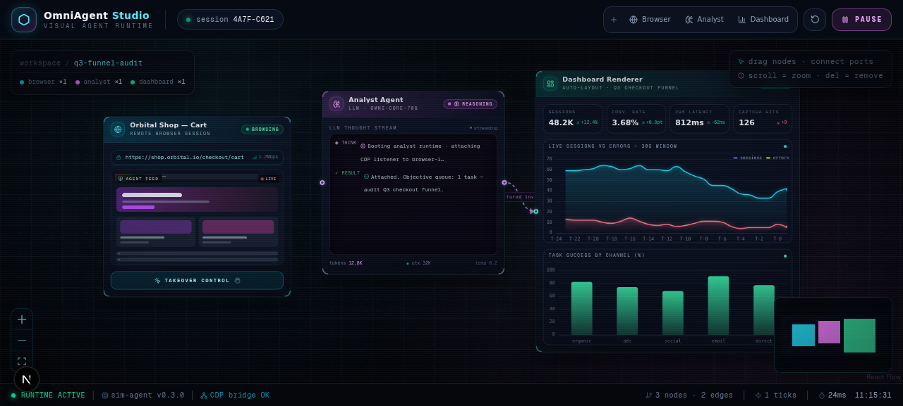

# ⚡ OmniAgent Studio
> **Autonomous Web Intelligence & Analytics Canvas with Human-in-the-Loop**



OmniAgent Studio là nền tảng điều phối Agent trực quan trên Infinite Canvas. Hệ thống giải quyết triệt để bài toán CAPTCHA và Cloudflare nhờ cơ chế **Human Takeover** thời gian thực qua giao thức Chrome DevTools Protocol (CDP).

---

## 🏗️ Kiến trúc hệ thống

```text
[User Browser]
      │  (WebSocket / Screencast & Input Relay)
      ▼
[FastAPI Backend: apps/api]
      │  (CDP Session / Page.startScreencast)
      ▼
[Chromium Sandbox: infra/sandbox-browser] ──(Extracted Data)──► [Analyst LLM] ──► [ECharts Canvas]
