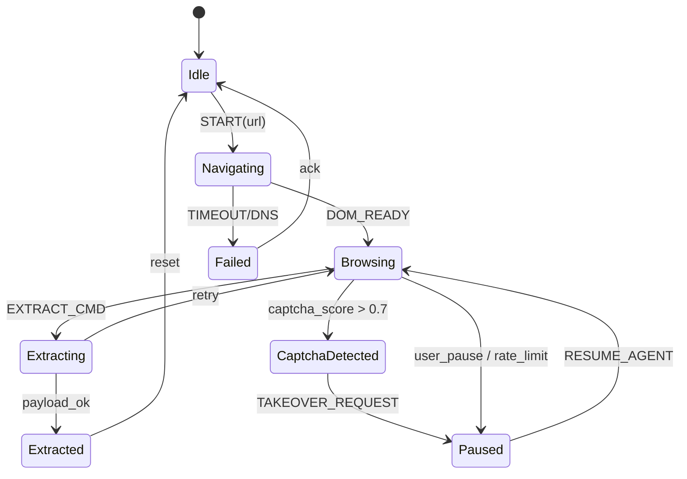

# SPEC.md — OmniAgent Studio

> Autonomous Web Intelligence & Analytics Canvas
> Version: 0.1.0-draft · Status: Architecture Freeze

---

## 1. Project Directory Structure (Monorepo)

```
omniagent-studio/
├── .github/
│   ├── workflows/ci.yml
│   └── ISSUE_TEMPLATE/
├── apps/
│   ├── web/                            # Frontend (React + Vite + TS)
│   │   ├── src/
│   │   │   ├── canvas/
│   │   │   │   ├── nodes/
│   │   │   │   │   ├── BrowserNode.tsx
│   │   │   │   │   ├── AnalystNode.tsx
│   │   │   │   │   └── DashboardNode.tsx
│   │   │   │   ├── edges/
│   │   │   │   ├── StreamCanvas.tsx    # <canvas> WebRTC/WS renderer
│   │   │   │   └── graphStore.ts       # Zustand
│   │   │   ├── dashboards/
│   │   │   │   ├── EChartsRenderer.tsx
│   │   │   │   ├── TremorRenderer.tsx
│   │   │   │   └── schemaValidator.ts  # Ajv + DashboardSpec schema
│   │   │   ├── transport/
│   │   │   │   ├── wsClient.ts         # Reconnecting WS
│   │   │   │   ├── sseClient.ts        # LLM thought stream
│   │   │   │   └── protocols.ts        # Shared TS types (mirror JSON schema)
│   │   │   ├── hooks/
│   │   │   ├── routes/
│   │   │   └── main.tsx
│   │   ├── package.json
│   │   └── vite.config.ts
│   │
│   └── api/                            # Backend (FastAPI)
│       ├── src/omniagent/
│       │   ├── main.py
│       │   ├── config.py
│       │   ├── api/
│       │   │   ├── routes_graph.py
│       │   │   ├── routes_stream.py    # WS + SSE
│       │   │   └── routes_takeover.py
│       │   ├── graph/
│       │   │   ├── state_machine.py    # Node FSM registry
│       │   │   ├── orchestrator.py     # LangGraph-style scheduler
│       │   │   └── nodes/
│       │   │       ├── browser_node.py
│       │   │       ├── analyst_node.py
│       │   │       └── dashboard_node.py
│       │   ├── sandboxes/
│       │   │   ├── browser/
│       │   │   │   ├── driver.py       # Playwright + CDP
│       │   │   │   ├── streamer.py     # CDP Screencast → WS
│       │   │   │   ├── human_takeover.py
│       │   │   │   └── captcha_detector.py
│       │   │   └── data/
│       │   │       ├── duckdb_engine.py
│       │   │       └── cleaners.py
│       │   ├── llm/
│       │   │   ├── client.py           # LiteLLM / OpenAI / Anthropic
│       │   │   └── prompts/
│       │   ├── schemas/                # Pydantic v2 models
│       │   │   ├── ws_protocol.py
│       │   │   ├── dashboard_spec.py
│       │   │   └── graph_state.py
│       │   └── utils/
│       ├── pyproject.toml
│       └── Dockerfile
│
├── packages/
│   ├── protocol/                       # Shared JSON Schema (source of truth)
│   │   ├── ws-protocol.schema.json
│   │   ├── dashboard-spec.schema.json
│   │   └── generate.ts
│   └── ui/                             # Shared React components
│
├── infra/
│   ├── docker-compose.yml
│   ├── docker-compose.prod.yml
│   ├── sandbox-browser/
│   │   ├── Dockerfile                  # Playwright + Chromium + ffmpeg
│   │   └── entrypoint.sh
│   └── otel/                           # OpenTelemetry collector
│
├── docs/
│   ├── SPEC.md
│   ├── ARCHITECTURE.md
│   └── PROTOCOL.md
├── tests/
│   ├── e2e/                            # Playwright (self-hosted app)
│   └── contract/                       # Pact / JSON schema validation
├── turbo.json
├── pnpm-workspace.yaml
└── README.md
```

---

## 2. Data Flow & State Machine

### 2.1 Topology

```
[User] ──WS/SSE──> [FastAPI Orchestrator] ──gRPC/WS──> [Browser Sandbox (Docker)]
                          │                                     │
                          │                              CDP Screencast
                          ▼                                     │
                    [Analyst LLM] <──── extracted_data ─────────┘
                          │
                     DashboardSpec
                          ▼
                  [DashboardNode] ──WS──> [React Flow Canvas]
```

### 2.2 BrowserNode FSM



| State | Emits | Accepts |
|---|---|---|
| `Idle` | `NODE_STATUS_CHANGE` | `START` |
| `Browsing` | `SCREEN_FRAME`, `LLM_THOUGHT` | `MOUSE_EVENT`, `KEYBOARD_EVENT`, `TAKEOVER_REQUEST` |
| `CaptchaDetected` | `NODE_STATUS_CHANGE{reason:"captcha"}` | `TAKEOVER_REQUEST` |
| `Paused` | `NODE_STATUS_CHANGE` | `MOUSE_EVENT`, `KEYBOARD_EVENT`, `RESUME_AGENT` |
| `Extracted` | `NODE_STATUS_CHANGE{artifact_id}` | — |

### 2.3 AnalystNode FSM

`Idle → Ingesting → Reasoning ⇄ ToolCall → EmittingSpec → Idle`

### 2.4 DashboardNode FSM

`Idle → Binding → Live ⇄ Streaming → Frozen`

---

## 3. WebSocket Communication Protocol

**Endpoint:** `wss://{host}/ws/graph/{graph_id}?token={jwt}`
**Envelope (all messages):**

```json
{
  "v": 1,
  "id": "uuid-v4",
  "ts": 1731000000000,
  "type": "MOUSE_EVENT",
  "node_id": "browser-01",
  "payload": { }
}
```

### 3.1 Client → Server

**MOUSE_EVENT**
```json
{
  "type": "MOUSE_EVENT",
  "node_id": "browser-01",
  "payload": {
    "action": "move|down|up|click|wheel",
    "x": 412.5, "y": 233.0,
    "button": 0,
    "delta_y": -120,
    "modifiers": ["shift"]
  }
}
```

**KEYBOARD_EVENT**
```json
{
  "type": "KEYBOARD_EVENT",
  "node_id": "browser-01",
  "payload": {
    "action": "keydown|keyup|char",
    "key": "Enter",
    "code": "Enter",
    "text": "\n",
    "modifiers": ["ctrl"]
  }
}
```

**TAKEOVER_REQUEST**
```json
{
  "type": "TAKEOVER_REQUEST",
  "node_id": "browser-01",
  "payload": { "reason": "captcha|manual|debug", "lease_ms": 120000 }
}
```

**RESUME_AGENT**
```json
{
  "type": "RESUME_AGENT",
  "node_id": "browser-01",
  "payload": { "handoff_note": "solved_recaptcha_v2" }
}
```

### 3.2 Server → Client

**SCREEN_FRAME** (text envelope w/ base64; binary frames out-of-band optional)
```json
{
  "type": "SCREEN_FRAME",
  "node_id": "browser-01",
  "payload": {
    "seq": 8421,
    "format": "jpeg",
    "width": 1280, "height": 720,
    "data_b64": "/9j/4AAQSkZJRg...",
    "ts": 1731000000123,
    "keyframe": false
  }
}
```

**LLM_THOUGHT** (SSE-compatible payload)
```json
{
  "type": "LLM_THOUGHT",
  "node_id": "analyst-01",
  "payload": {
    "delta": "The table shows a 12% drop...",
    "phase": "reasoning|tool_call|final",
    "tokens": 42,
    "done": false
  }
}
```

**NODE_STATUS_CHANGE**
```json
{
  "type": "NODE_STATUS_CHANGE",
  "node_id": "browser-01",
  "payload": {
    "from": "Browsing",
    "to": "CaptchaDetected",
    "reason": "captcha_score=0.91",
    "ts": 1731000000200
  }
}
```

**DASHBOARD_SPEC**
```json
{
  "type": "DASHBOARD_SPEC",
  "node_id": "dashboard-01",
  "payload": { "$ref": "packages/protocol/dashboard-spec.schema.json" }
}
```

---

## 4. Dashboard Schema Standard

`packages/protocol/dashboard-spec.schema.json` — **source of truth**; frontend validates via Ajv, backend emits via Pydantic.

```json
{
  "$schema": "https://json-schema.org/draft/2020-12/schema",
  "$id": "https://omniagent.dev/schemas/dashboard-spec.json",
  "title": "DashboardSpec",
  "type": "object",
  "required": ["version", "layout", "widgets", "datasets"],
  "additionalProperties": false,
  "properties": {
    "version": { "const": "1.0" },
    "title": { "type": "string", "maxLength": 120 },
    "layout": {
      "type": "object",
      "required": ["cols", "rows", "gap"],
      "properties": {
        "cols": { "type": "integer", "minimum": 1, "maximum": 24 },
        "rows": { "type": "integer", "minimum": 1 },
        "gap":  { "type": "integer", "minimum": 0, "default": 16 }
      }
    },
    "datasets": {
      "type": "array",
      "items": {
        "type": "object",
        "required": ["id", "rows", "fields"],
        "properties": {
          "id": { "type": "string", "pattern": "^[a-z0-9_]+$" },
          "rows": { "type": "array", "items": { "type": "array" } },
          "fields": {
            "type": "array",
            "items": {
              "type": "object",
              "required": ["name", "type"],
              "properties": {
                "name": { "type": "string" },
                "type": { "enum": ["string", "number", "integer", "boolean", "date", "datetime"] },
                "unit": { "type": "string" }
              }
            }
          }
        }
      }
    },
    "widgets": {
      "type": "array",
      "minItems": 1,
      "items": {
        "type": "object",
        "required": ["id", "type", "dataset", "grid", "encoding"],
        "properties": {
          "id":   { "type": "string" },
          "type": { "enum": ["line", "bar", "area", "pie", "scatter", "table", "kpi", "heatmap"] },
          "dataset": { "type": "string" },
          "grid": {
            "type": "object",
            "required": ["x", "y", "w", "h"],
            "properties": {
              "x": { "type": "integer", "minimum": 0 },
              "y": { "type": "integer", "minimum": 0 },
              "w": { "type": "integer", "minimum": 1 },
              "h": { "type": "integer", "minimum": 1 }
            }
          },
          "encoding": {
            "type": "object",
            "required": ["x"],
            "properties": {
              "x":       { "$ref": "#/$defs/fieldRef" },
              "y":       { "$ref": "#/$defs/fieldRef" },
              "series":  { "$ref": "#/$defs/fieldRef" },
              "value":   { "$ref": "#/$defs/fieldRef" },
              "category":{ "$ref": "#/$defs/fieldRef" }
            }
          },
          "options": {
            "type": "object",
            "description": "Passthrough ECharts options — whitelisted keys only",
            "properties": {
              "stack":     { "type": "boolean" },
              "smooth":    { "type": "boolean" },
              "showLegend":{ "type": "boolean" },
              "palette":   { "type": "array", "items": { "type": "string" } },
              "yAxis":     { "type": "object" }
            },
            "additionalProperties": false
          }
        }
      }
    }
  },
  "$defs": {
    "fieldRef": {
      "oneOf": [
        { "type": "string" },
        { "type": "object", "required": ["field"], "properties": { "field": {"type":"string"}, "agg": {"enum":["sum","avg","min","max","count","none"]} } }
      ]
    }
  }
}
```

### 4.1 Example Emission

```json
{
  "version": "1.0",
  "title": "Competitor Pricing — Q4",
  "layout": { "cols": 12, "rows": 6, "gap": 16 },
  "datasets": [{
    "id": "pricing",
    "fields": [
      { "name": "month", "type": "date" },
      { "name": "price", "type": "number", "unit": "USD" }
    ],
    "rows": [["2024-10-01", 39], ["2024-11-01", 42], ["2024-12-01", 38]]
  }],
  "widgets": [{
    "id": "w1", "type": "line", "dataset": "pricing",
    "grid": { "x": 0, "y": 0, "w": 8, "h": 4 },
    "encoding": { "x": "month", "y": { "field": "price", "agg": "avg" } },
    "options": { "smooth": true, "showLegend": true }
  }]
}
```

### 4.2 Rendering Contract (Frontend)

1. Validate against schema → on failure emit `DASHBOARD_SPEC_INVALID` telemetry, render fallback table.
2. Map `type` → renderer registry (`EChartsRenderer`, `TremorRenderer`).
3. Field resolution: `encoding.*` → column index via `dataset.fields`.
4. ECharts options are **whitelisted**; unknown keys dropped.
5. Grid units are CSS-grid cells derived from `layout.cols × layout.rows`.

---

## 5. Non-Functional Contracts

| Concern | Guarantee |
|---|---|
| WS frame latency (p95) | ≤ 80 ms LAN |
| Screencast FPS | 15–30 (adaptive on backpressure) |
| Takeover lease | auto-expire via server timer, emits `NODE_STATUS_CHANGE{Paused→Browsing}` |
| Schema versioning | additive-only within `v1`; breaking → `v2` + dual-emit window |
| Sandbox isolation | rootless Chromium, `--no-sandbox` off, seccomp profile |

---

## 6. Shared Type Generation

`packages/protocol/generate.ts` → emits `protocol.d.ts` for TS and `protocol.py` (Pydantic v2) for Python from the two JSON Schemas. **Single source of truth = `packages/protocol/*.schema.json`.**
